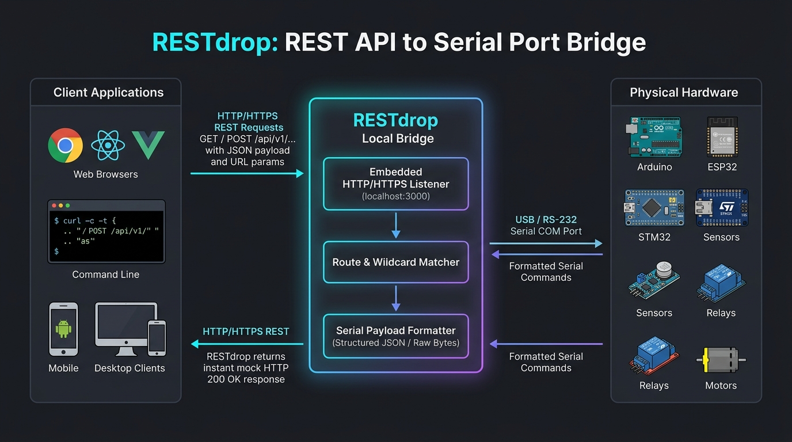
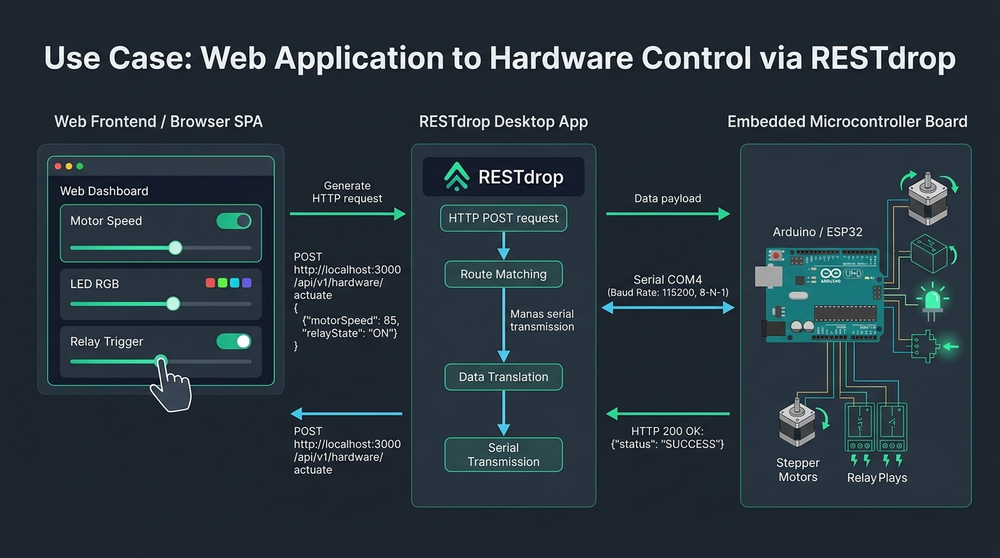
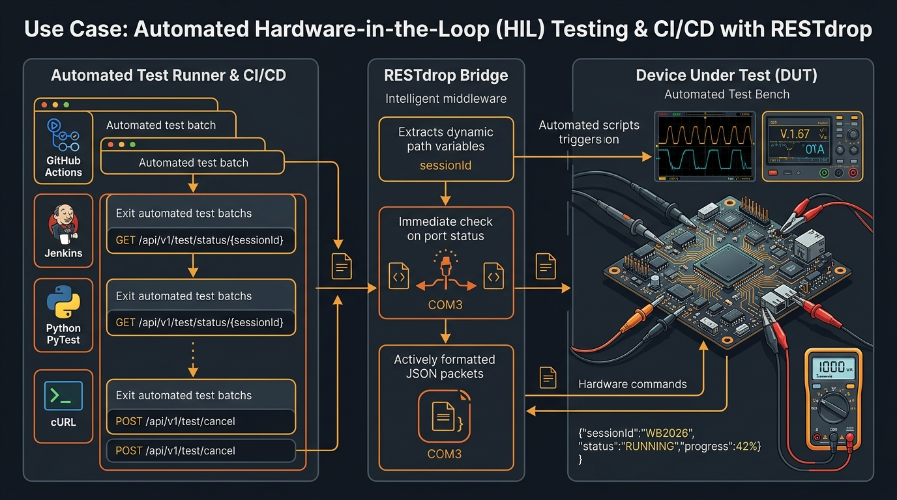
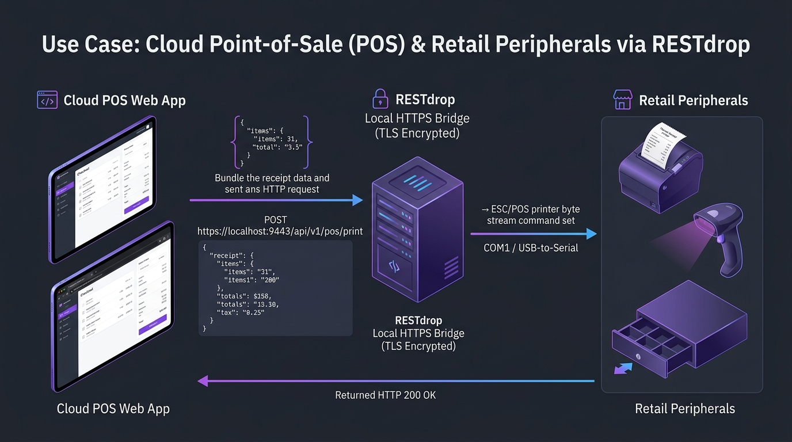
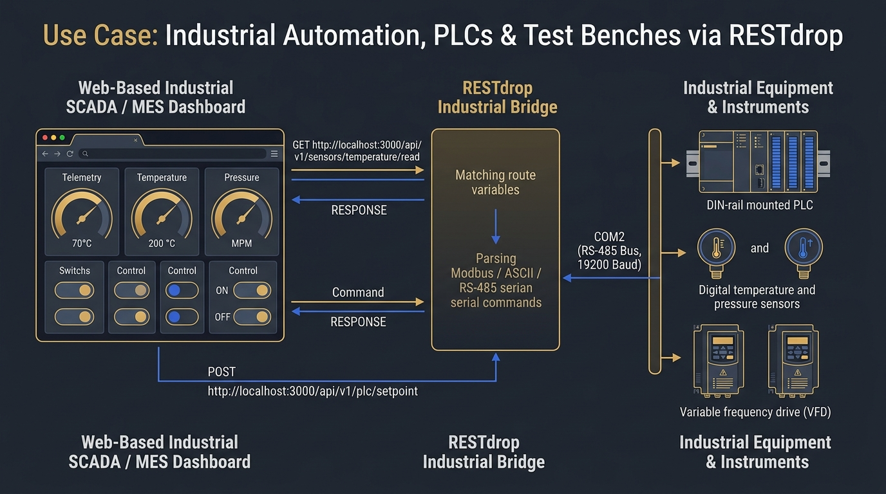
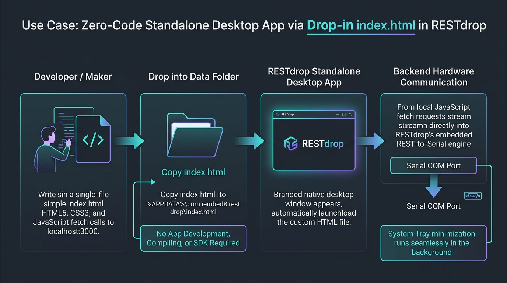
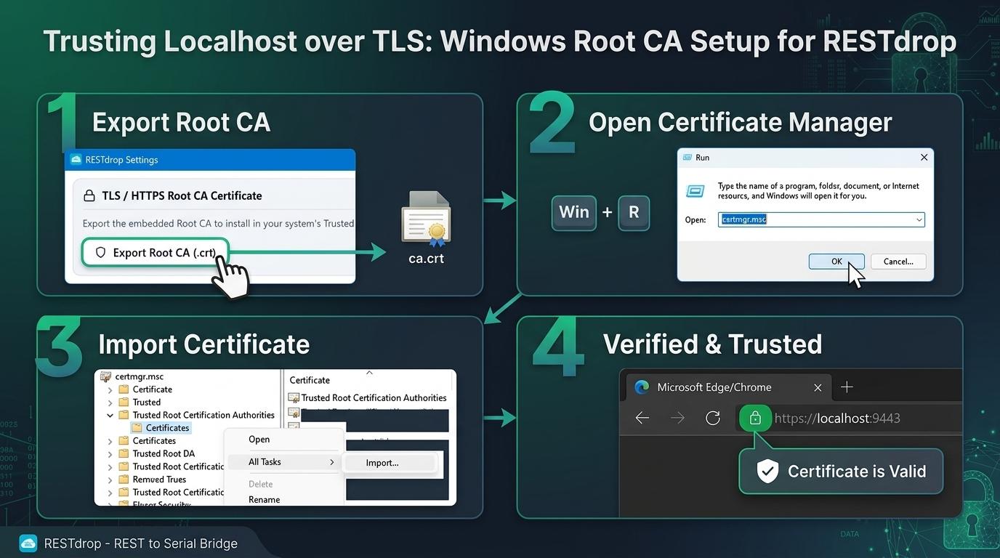

# RESTdrop - Embedded REST API to Serial Port Bridge

[-0078D6?logo=windows&logoColor=white)](https://manavakela1996.github.io/RESTdrop)
[](#system-requirements)
[](https://tauri.app)
[](https://manavakela1996.github.io/RESTdrop)

**RESTdrop** is a high-performance cross-platform desktop application that bridges modern web applications, test automation scripts, and developer tools directly to physical or virtual computer **Serial (COM / TTY) ports** via a lightweight embedded REST API server.

---

## 🌐 Official Web Pages & Links

- 🚀 **Official Downloads Portal:** [https://manavakela1996.github.io/RESTdrop](https://manavakela1996.github.io/RESTdrop)
- 🔒 **Privacy Policy:** [https://manavakela1996.github.io/RESTdrop/privacy_policy.html](https://manavakela1996.github.io/RESTdrop/privacy_policy.html)
- 📜 **Terms of Use:** [https://manavakela1996.github.io/RESTdrop/terms.html](https://manavakela1996.github.io/RESTdrop/terms.html)
- 💻 **GitHub Repository:** [https://github.com/manavakela1996/RESTdrop/](https://github.com/manavakela1996/RESTdrop/)

---

## 💡 Overview

Web applications and browser sandboxes are strictly isolated from native operating system hardware, preventing direct access to physical serial interfaces (RS-232, RS-485, USB-to-UART).

**RESTdrop** solves this challenge by running as a local, embedded loopback bridge:
1. It listens for incoming standard HTTP or HTTPS requests (`localhost` / `127.0.0.1`) on configurable ports.
2. It captures URL route parameters, wildcard subpaths, and request payload bodies.
3. It formats and immediately transmits the data across your assigned computer Serial COM port.
4. It returns structured, user-defined mock responses back to the caller in milliseconds.

---

## 📊 Data Flow Architecture & Use Cases

### 1. Core Data Flow Overview


---

## 🎯 Practical Use Cases

### Use Case A: Web-to-Hardware Control (MCU / IoT / Robotics)
Connect web-based single-page applications (React, Vue, Angular, vanilla JS) to microcontrollers (Arduino, ESP32, STM32, Raspberry Pi Pico) without requiring WebSerial or browser extensions.


### Use Case B: Automated Hardware-in-the-Loop (HIL) Testing & CI/CD
Integrate physical Device-Under-Test (DUT) hardware into automated CI/CD pipelines (GitHub Actions, Jenkins, PyTest) using standard REST requests (`cURL`, Python `requests`, Postman).


### Use Case C: Cloud Point-of-Sale (POS) & Retail Peripherals
Drive serial receipt printers, barcode scanners, electronic cash drawers, customer displays, and weight scales directly from cloud or web-based POS software over secure local HTTPS.


### Use Case D: Industrial Automation, PLCs & Test Benches
Connect PLCs, digital multimeters, oscilloscopes, motor drives (VFD), and environmental sensors into web dashboards via RS-485 / Modbus / Serial.


### Use Case E: Zero-Code Standalone Desktop App (Drop-in `index.html`)
Build and distribute branded desktop apps with **zero coding or compilation**. Simply copy any single-file HTML5/CSS/JavaScript page into `%APPDATA%\com.iembed8.restdrop\index.html`. RESTdrop automatically loads it as a native desktop application shell, allowing your custom HTML UI to trigger serial hardware commands via `fetch('http://localhost:3000/...')` while retaining System Tray background persistence.


---

## ✨ Key Features

- **Multi-Port Concurrent Listeners:**
  Spin up and run multiple independent REST servers simultaneously on custom ports (e.g., `3000`, `8080`, `9443`), routing each to separate serial ports.
- **Support for Localhost over TLS:**
  Built-in support for localhost over TLS (`https://localhost:port`), allowing web apps running in secure contexts to communicate without mixed-content browser restrictions.
- **Dynamic Route Matching & Wildcard Capture:**
  Support for parameterized routes (e.g., `/api/v1/test/status/{sessionId}`) and wildcard path capture (`/api/v1/instance/*`) to forward deep route paths directly to the serial device.
- **Flexible Serial Payload Formatting:**
  - **Structured JSON:** Automatically packs request method, path, query parameters, path variables, timestamp, and body into a structured JSON string.
  - **Raw Stream:** Directly forwards raw request payloads or query strings byte-for-byte to the serial port.
  - **Custom Template:** Define custom protocols using variables such as `{{method}}`, `{{path}}`, `{{body}}`, `{{sessionId}}`, and `{{timestamp}}`.
- **Hardware Serial Configuration:**
  Auto-detects computer COM ports with baud rates from `9,600` to `921,600`, customizable data bits, parity, stop bits, and line delimiters (`\r\n` CRLF, `\n` LF, or None).
- **Auto-Disable Protection:**
  Gracefully pauses listeners if an assigned serial port is detached or busy, preventing application crashes.
- **Live Traffic Monitor & Simulator:**
  Inspect incoming requests in real-time with latency measurements, payload sizes, and transmission confirmations. Includes an interactive REST simulator with 1-click `cURL` command generation.
- **System Tray & Background Mode:**
  Minimizes cleanly to the Windows System Tray on close (when configured), ensuring active bridges keep processing traffic in the background.
- **Startup Auto-Launch & Taskbar Minimization:**
  Supports autostart at Windows logon (`--minimized`) to run immediately minimized in the taskbar.
- **Silent Installation (`/s` Flag):**
  Fully compatible with Microsoft Store Win32 packaging, WinGet, and automated enterprise deployments.
- **100% Private & Local:**
  Zero telemetry, zero remote tracking, zero outbound internet requirements. All configuration and traffic data remain strictly on your local machine.

---

## 📥 Installation & Download Links

Download the latest version directly from the [Official Setup & Downloads Portal](https://manavakela1996.github.io/RESTdrop):

| Package | Format | Architecture | Download Link |
| :--- | :--- | :--- | :--- |
| **Standard Installer (Recommended)** | `.exe` | Windows 64-bit | [RESTdrop_0.1.1_x64-setup.exe](setup/setup/RESTdrop_0.1.1_x64-setup.exe) |
| **Windows Package** | `.msi` | Windows 64-bit | [RESTdrop_0.1.1_x64_en-US.msi](setup/setup/RESTdrop_0.1.1_x64_en-US.msi) |

### Silent Installation Commands

#### Standard Installer (`.exe`):
Ideal for Microsoft Store packaging, WinGet, and automated terminal installation.
The `.exe` installer supports all of the following silent switches interchangeably:
- `RESTdrop_0.1.1_x64-setup.exe /s` (Standard / Recommended)
- `RESTdrop_0.1.1_x64-setup.exe /S`
- `RESTdrop_0.1.1_x64-setup.exe /qn`
- `RESTdrop_0.1.1_x64-setup.exe /quiet`

*(All return exit code `0` on successful installation).*

To uninstall silently:
```cmd
Uninstall.exe /s
```
*(Also supports `/S`, `/qn`, and `/quiet`).*

#### Windows Package (`.msi`):
Ideal for Active Directory Group Policy (GPO), Microsoft Intune, and enterprise administration:
```cmd
msiexec /i RESTdrop_0.1.1_x64_en-US.msi /qn
```

---

## 🚀 Quick Start & API Examples

### 1. GET Request Example

**Send REST Request:**
```bash
curl http://localhost:3000/api/v1/test/status/WB2026001-2026-08-04T112030
```

**Payload Sent to Serial Port (`COM3`):**
```json
{"instance":"Session Status (GET)","method":"GET","path":"/api/v1/test/status/WB2026001-2026-08-04T112030","pathParams":{"sessionId":"WB2026001-2026-08-04T112030"},"timestamp":"2026-09-11T09:30:00Z"}
```

**Returned HTTP Response (200 OK):**
```json
{
  "sessionId": "WB2026001-2026-08-04T112030",
  "status": "RUNNING",
  "progress": 42,
  "stage": "STAGE_1",
  "elapsedSeconds": 125,
  "remainingSeconds": 85
}
```

---

### 2. POST Request Example with JSON Body

**Send REST Request:**
```bash
curl -X POST http://localhost:3000/api/v1/example/test/cancel \
  -H "Content-Type: application/json" \
  -d '{"sessionId": "WB2026001-2026-08-04T112030", "reason": "Operator Cancelled"}'
```

**Payload Sent to Serial Port (`COM3`):**
```json
{"body":{"reason":"Operator Cancelled","sessionId":"WB2026001-2026-08-04T112030"},"instance":"Session Cancel (POST)","method":"POST","path":"/api/v1/example/test/cancel","timestamp":"2026-09-11T09:30:15Z"}
```

**Returned HTTP Response (200 OK):**
```json
{
  "sessionId": "WB2026001-2026-08-04T112030",
  "status": "SUCCESS",
  "message": "Test cancelled"
}
```

---

### 3. HTTPS Localhost over TLS with Wildcard Subpath

**Send Secure REST Request:**
```bash
curl -k -X POST https://localhost:9443/api/v1/instance1/example/test/testdata1/channelA/sample4 \
  -H "Content-Type: application/json" \
  -d '{"voltage": 12.4, "current": 1.85}'
```

**Payload Sent to Serial Port (`COM4`):**
```json
{"body":{"current":1.85,"voltage":12.4},"instance":"HTTPS Test Data Bridge","method":"POST","path":"/api/v1/instance1/example/test/testdata1/channelA/sample4","remainder":"/channelA/sample4","timestamp":"2026-09-11T09:30:30Z"}
```

---

## 🔒 Trusting Localhost over TLS (Root CA Setup)

To allow browsers (Edge, Chrome) and HTTP clients (`curl`) to communicate with `https://localhost:<port>` without TLS certificate security warnings:

### 1. Export the Root CA Certificate
1. Open **RESTdrop** and navigate to the **TLS / HTTPS** settings panel.
2. Click **Export Root CA (.crt)** to save the public root certificate file (`ca.crt`) to your computer.

### 2. Import Root CA into Windows Trust Store (`certmgr.msc`)
1. Press `Win + R`, type **`certmgr.msc`**, and press **Enter** to open the Windows Certificate Manager.
2. In the left navigation pane, expand **Trusted Root Certification Authorities** → click **Certificates**.
3. Right-click on the **Certificates** folder → select **All Tasks** → **Import...**.
4. In the Certificate Import Wizard, click **Next**, click **Browse...**, select your exported `ca.crt` file, and click **Next**.
5. Verify the Certificate Store is set to **Trusted Root Certification Authorities** and click **Finish**.
6. When Windows displays the security warning prompt asking to trust and install the certificate, click **Yes**.



Once imported, calls to `https://localhost:<port>` are recognized and trusted natively across Windows, browsers, and terminal tools without warning prompts.

---

## ⚙️ Startup Execution & Taskbar Minimization

- **Windows Logon Autostart:** RESTdrop registers an autostart entry in `HKCU\Software\Microsoft\Windows\CurrentVersion\Run` with the `--minimized` flag.
- **Taskbar Minimization:** On user logon, the application initializes background listeners for saved and active instances and starts minimized directly to the **Windows Taskbar**.
- **Terminal Execution:** To test or launch minimized manually from the command prompt:
  ```cmd
  RESTdrop.exe --minimized
  ```

---

## 📋 System Requirements

- **Operating System:** Windows 10 (Build 19041+) or Windows 11 (64-bit)
- **Architecture:** x86_64 (AMD64 / Intel 64)
- **Hardware Interface:** Physical COM port, USB-to-UART bridge (FTDI, CP2102, CH340), or virtual COM pair (com0com, VSPE)
- **Web Runtime:** Microsoft Edge WebView2 (pre-installed on Windows 10/11)

---

## 📄 License

### License-Free Software (Public & Unrestricted)
**RESTdrop is license-free software.** 

Anyone is free to use, distribute, publish, or commercially sell this software and its accompanying documentation as a compiled binary for **any purpose**—including commercial, personal, and educational use—without restrictions or licensing fees.

> **Note:** While unrestricted for all users and purposes, this software is **highly encouraged for use by individuals, makers, students, and hobbyists** exploring microcontrollers, embedded hardware-in-the-loop testing, and web-to-serial integrations.

---

## 📬 Support & Contact

- **Developer:** Manav Akela
- **Publisher:** iEmbed8
- **Support Email:** [mail@iembed8.com](mailto:mail@iembed8.com)
- **Downloads Portal:** [https://manavakela1996.github.io/RESTdrop](https://manavakela1996.github.io/RESTdrop)
- **Privacy Policy:** [https://manavakela1996.github.io/RESTdrop/privacy_policy.html](https://manavakela1996.github.io/RESTdrop/privacy_policy.html)
- **Terms of Use:** [https://manavakela1996.github.io/RESTdrop/terms.html](https://manavakela1996.github.io/RESTdrop/terms.html)
